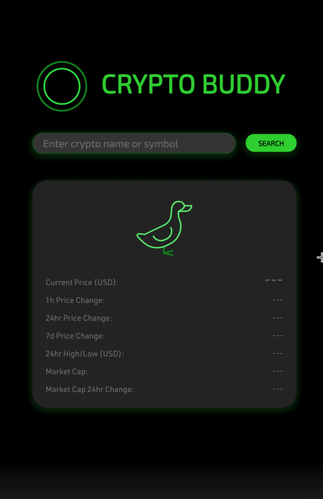

<h1>Crypto Buddy</h1>

A responsive website that searches and displays market information for cryptocurrencies, and also shows the currently most searched assets. Fits the majority of mobile/tablet/computer screens.
  

<h2><b>Preview:</b></h2>
 
Link to page: <a href="https://faustinacheng.github.io/crypto-buddy/">https://faustinacheng.github.io/crypto-buddy/</a>
  

  

  

<h2><b>Development:</b></h2>
 
Built with HTML/CSS/JavaScript with data provided by the CoinGecko API. Mockup done in Figma.
  
<h2><b>Ending Thoughts:</b></h2>
 
There are a couple of features that I would like to add in the future, such as more lists such as highest percentage growth in a day, and sorting of lists by columns.
  

<H2><B>Contributors:</B></H2>
<a href="https://github.com/faustinacheng">Faustina</a> &
<a href="https://github.com/Pratyush-exe">Pratyush</a>
